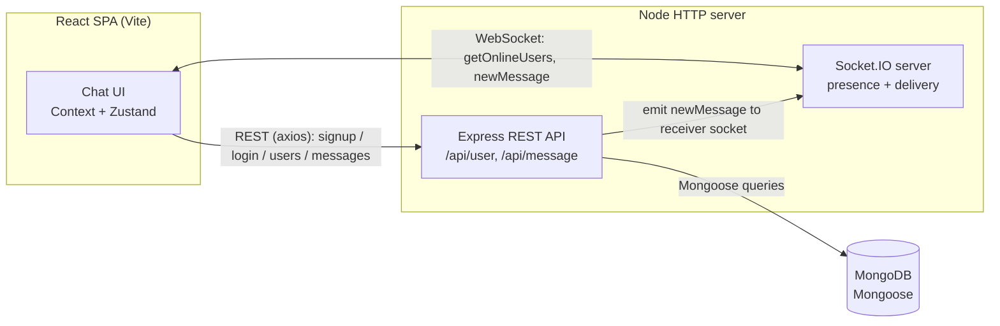

# Realtime Chat App

> A full-stack 1:1 messaging app where each message is pushed straight to the recipient's socket — no polling, no refresh. Built on the MERN stack with Socket.IO real-time delivery, JWT-cookie auth, and deployed as a single Render service that serves both the API and the SPA.

**Realtime Chat App** lets registered users sign in, browse other users, and exchange direct messages that arrive instantly. Messages are persisted in MongoDB, authentication is handled with JSON Web Tokens stored in an httpOnly cookie, and live presence (who's online) plus incoming-message delivery are powered by a Socket.IO WebSocket layer running alongside the Express REST API. The React single-page app is built with Vite and styled with Tailwind CSS and DaisyUI.

### Highlights

- **Direct socket delivery** — messages are emitted to the recipient's exact socket via an in-memory `userId → socketId` map, so there is no polling and no broadcast spray.
- **Server-trusted identity** — protected actions key off the `userId` decoded from the JWT cookie on the server, never a client-supplied id.
- **Hardened auth cookie** — the JWT lives in an `httpOnly`, `secure`, `sameSite=strict` cookie, so it is never readable from client-side JavaScript.
- **Live presence** — the full online-user list is broadcast to every client on each connect and disconnect.
- **One deployable** — a single Render web service serves the Express API, the Socket.IO channel, and the compiled React SPA.

[](https://react.dev/)
[](https://nodejs.org/)
[](https://expressjs.com/)
[](https://www.mongodb.com/)
[](https://socket.io/)
[](https://jwt.io/)
[](https://render.com/)

---

### Live Demo

**[chatapp-deploy-1.onrender.com](https://chatapp-deploy-1.onrender.com)**

> Hosted on Render's free tier, which sleeps after a period of inactivity. The **first request after idle can take ~30–60 seconds** to wake the service — give it a moment and refresh if needed. To see real-time delivery, open the app in two browser windows logged in as two different users and watch a message arrive in the second window without a refresh.

---

## Table of Contents

- [Overview](#overview)
- [Features](#features)
- [Tech Stack](#tech-stack)
- [Architecture / How It Works](#architecture--how-it-works)
- [REST API](#rest-api)
- [Socket.IO Events](#socketio-events)
- [Data Model](#data-model)
- [Project Structure](#project-structure)
- [Getting Started](#getting-started)
- [Environment Variables](#environment-variables)
- [Available Scripts](#available-scripts)
- [Deployment](#deployment)
- [Roadmap / Known Limitations](#roadmap--known-limitations)
- [Acknowledgements](#acknowledgements)
- [Contact](#contact)

---

## Overview

Realtime Chat App is a full-stack MERN application that demonstrates the core patterns behind a modern messaging product:

- **Token-based authentication** — users sign up and log in; the server issues a JWT that is stored in an httpOnly cookie, so the token is never exposed to client-side JavaScript.
- **REST for state, WebSockets for real-time** — account actions, user listing, and message history go through a conventional Express REST API; live message delivery and online-presence updates ride a Socket.IO channel attached to the same HTTP server.
- **Persistent conversations** — every message is stored in MongoDB and grouped into a conversation document keyed by its two participants, so chat history survives reloads and reconnects.

The app is deployed as a **single web service on Render**: the Express backend serves the compiled React/Vite frontend as static files with a SPA fallback, so one service hosts both the API and the UI.

---

## Features

### 🔐 Authentication & Sessions
- Email/password **sign up** with client-side confirm-password matching and server-side duplicate-email rejection.
- **Login** with bcrypt-hashed password verification.
- JWT issued on success and stored in an **httpOnly, secure, sameSite=strict cookie** named `jwt`. The JWT *token* expires in 10 days (`expiresIn: '10d'`); the cookie itself is set with no `maxAge`, so it behaves as a session cookie in the browser.
- **Logout** clears the auth cookie and local session state.
- Auth-gated client routing: the chat screen is only reachable when authenticated; otherwise the user is redirected to `/login`.

### 💬 Messaging
- **One-to-one direct messaging** between any two registered users.
- Messages are persisted and grouped into a per-participant **conversation**.
- **Conversation history** is fetched on selecting a chat and rendered as aligned chat bubbles with timestamps.
- **Optimistic send** — outgoing messages render in the thread immediately on submit, before the server round-trip confirms.

### ⚡ Real-Time (Socket.IO)
- **Live message delivery** — when you send a message, it is pushed straight to the recipient's socket if they are connected, with no polling.
- **Online presence** — an online-users list is broadcast to all clients on every connect/disconnect.
- **Incoming-message notification sound** plays when a new message arrives.

### 🖥️ Interface
- Responsive **DaisyUI drawer layout**: a left sidebar (search, user list, logout) and a right chat pane.
- **Client-side user search** by name over the already-loaded user list.
- Per-user **online/offline indicator** derived from the live presence list.
- **Toast notifications** for success and error states across auth and search flows.

---

## Tech Stack

| Layer | Technology | Role |
|---|---|---|
| **Frontend** | React 18, Vite 5 | SPA UI and build tooling |
| | React Router DOM 6 | Client-side, auth-gated routing |
| | Zustand 4 | Conversation/message client store |
| | React Context | Auth state and Socket.IO connection sharing |
| | axios 1.6 | REST API calls |
| | socket.io-client 4.7 | Real-time client connection |
| | react-hook-form 7 | Form state and validation |
| | react-hot-toast 2 | Toast notifications |
| | react-icons 5 | UI icons |
| | js-cookie 3 | Reads/clears the JWT cookie on the client |
| | Tailwind CSS 3 + DaisyUI 4 | Utility styling and UI components |
| **Backend** | Node.js, Express 4 | HTTP server and REST routing |
| | Socket.IO 4.7 | Real-time WebSocket server |
| | Mongoose 8 | MongoDB ODM / schema layer |
| | jsonwebtoken 9 | JWT signing and verification |
| | bcryptjs 2.4 | Password hashing |
| | cookie-parser 1.4 | Parses the JWT auth cookie |
| | cors 2.8 | Cross-origin middleware |
| | dotenv 16 | Loads environment variables |
| | nodemon 3 | Dev auto-reload |
| **Database** | MongoDB (via Mongoose) | Persistence for users, messages, conversations |
| **Hosting** | Render | Single web service (API + built frontend) |

---

## Architecture / How It Works

The React SPA talks to the Express server in two ways simultaneously: **stateless REST calls** for auth, user listing, and message history, and a **persistent Socket.IO connection** for live delivery and presence. Both are served by the same Node HTTP server — Socket.IO attaches to the Express app via `http.createServer(app)`.



**Authentication flow.** On signup/login the server hashes/verifies the password with bcrypt, signs a JWT containing the `userId`, and sets it as an httpOnly cookie named `jwt`. Protected routes run a `secureRoute` middleware that reads the cookie, verifies the token, loads the user (minus the password), and attaches it to `req.user`. **The JWT-derived user id — not a client-supplied value — is the trusted identity for protected actions.**

**REST for durable state.** The frontend uses relative `/api/...` paths. The Express routes are mounted under:
- `/api/user` — signup, login, logout, and listing all users except yourself (for the sidebar).
- `/api/message` — sending a message to a user and fetching the conversation history with a user.

**Real-time layer.** The Socket.IO server keeps an **in-memory map of `userId → socketId`**. On connect it records the socket and broadcasts the full online-user list (`getOnlineUsers`) to everyone; it does the same on disconnect. When a message is sent, the message controller looks up the receiver's socket id via `getReceiverSocketId()` and emits a `newMessage` event directly to that socket, so the recipient sees it instantly. The client store appends the incoming message and plays a notification sound.

**Persistence.** A message is saved as a `Message` document and its id is pushed into the `Conversation` document for that participant pair (creating the conversation if it does not yet exist). History reads populate the conversation's `messages`.

---

## REST API

All routes are mounted under `/api` and the frontend calls them with relative paths (resolved via the Vite dev proxy in development, or same-origin in production). Exact route paths are defined in the route modules; the table reflects the handlers' observed behavior.

> Implementation note: several handlers return HTTP **201** even for plain GET reads (e.g. listing users, fetching messages) and for logout. The status codes below reflect what the code actually returns rather than strict REST conventions.

### User — `/api/user`

| Method | Path | Auth | Body | Behavior |
|---|---|---|---|---|
| `POST` | `/signup` | — | `{ fullname, email, password, confirmPassword }` | Validates `password === confirmPassword`, rejects duplicate email, bcrypt-hashes the password, creates the user, sets the `jwt` cookie. `201` with `{ message, user: { _id, fullname, email } }`; `400` on mismatch or existing email. |
| `POST` | `/login` | — | `{ email, password }` | `User.findOne({ email })` then `bcrypt.compare`; on success sets the `jwt` cookie and returns the user. `201` on success; `400 "Invalid user credential"` on bad credentials. |
| `GET` | `/logout` | — | — | Clears the `jwt` cookie. `201` with `{ message: "User logged out successfully" }`. |
| `GET` | `/allusers` | ✅ `secureRoute` | — | Returns all users except the caller: `User.find({ _id: { $ne: req.user._id } }).select('-password')`. `201` with the user array. |

**Example — successful login response (`201`):**

```json
{
  "message": "User logged in successfully",
  "user": { "_id": "665f...", "fullname": "Demo User", "email": "demo@user.com" }
}
```

### Message — `/api/message`

| Method | Path | Auth | Body | Behavior |
|---|---|---|---|---|
| `POST` | `/send/:id` | ✅ `secureRoute` | `{ message }` | `:id` is the receiver. Finds-or-creates the `Conversation` for the participant pair, creates the `Message`, pushes its id onto `conversation.messages`, saves both, and emits a `newMessage` Socket.IO event to the receiver if online. `201` with the new message. |
| `GET` | `/get/:id` | ✅ `secureRoute` | — | `:id` is the other participant. Returns the populated `messages` array for the conversation, or `[]` if none. `201` with the message array. |

---

## Socket.IO Events

A single Socket.IO connection is opened by the client after auth, passing the user id as a connection query (`{ userId }`). The server maintains the `userId → socketId` map from these connections.

### Client → Server

| Event | Payload | Description |
|---|---|---|
| `connection` (query: `{ userId }`) | `userId` in the handshake query | On connect, the server registers `userId → socket.id` in the online-users map. |
| `disconnect` | — | On disconnect, the server removes the user from the map and re-broadcasts presence. |

### Server → Client

| Event | Payload | Description |
|---|---|---|
| `getOnlineUsers` | `string[]` (array of online `userId`s) | Broadcast to all clients on every connect and disconnect so each client can render presence. |
| `newMessage` | the new `Message` object | Emitted directly to the **receiver's** socket id when a message is sent, for instant delivery. The client appends it to the thread and plays a notification sound. |

---

## Data Model

Three Mongoose models, all with `{ timestamps: true }` (auto `createdAt` / `updatedAt`):

### User
| Field | Type | Notes |
|---|---|---|
| `fullname` | String | required |
| `email` | String | required, unique |
| `password` | String | required (stored bcrypt-hashed) |
| `confirmPassword` | String | optional — currently persisted on the schema (see [Known Limitations](#roadmap--known-limitations)) |

### Message
| Field | Type | Notes |
|---|---|---|
| `senderId` | ObjectId → `User` | required |
| `receiverId` | ObjectId → `User` | required |
| `message` | String | required |

### Conversation
| Field | Type | Notes |
|---|---|---|
| `members` | [ObjectId → `User`] | the participants |
| `messages` | [ObjectId → `Message`] | default `[]` |

**Relationships.** A `Message` references the `User` model twice (sender and receiver). A `Conversation` groups its `members` (users) and the `messages` exchanged between them; sending a message finds-or-creates the conversation for the participant pair and pushes the new message's id onto `messages`.

---

## Project Structure

This repository is **backend-rooted**: there is no top-level `package.json`. The backend lives at the repository root under `Backend/`, and the React frontend is **nested inside it** at `Backend/Frontend/`. The backend's `build` script installs and builds the frontend, and in production the backend serves the frontend's compiled `dist/` output.

```text
chatapp-deploy/
└── Backend/
    ├── index.js                 # Entry point: middleware, DB connect, routes, prod SPA serving
    ├── package.json             # Backend manifest + monorepo build script (type: module / ESM)
    ├── .env                     # (gitignored) backend secrets/config
    ├── SocketIO/
    │   └── server.js            # Express app + http server + Socket.IO server (presence map)
    ├── routes/
    │   ├── user.route.js         # /api/user routes
    │   └── message.route.js      # /api/message routes
    ├── controller/               # signup/login/logout, allUsers, sendMessage, getMessage
    ├── models/
    │   ├── user.model.js
    │   ├── message.model.js
    │   └── conversation.model.js
    ├── middleware/
    │   └── secureRoute.js        # JWT cookie verification, attaches req.user
    ├── jwt/
    │   └── generateToken.js      # Signs JWT, sets httpOnly cookie
    └── Frontend/                 # Nested Vite + React SPA
        ├── package.json          # Frontend manifest (depends on ../ as file:..)
        ├── vite.config.js        # Dev server :3001, /api proxy -> http://localhost:4002
        ├── index.html
        ├── tailwind.config.js
        ├── dist/                 # Build output served by the backend in production
        └── src/
            ├── main.jsx          # BrowserRouter > AuthProvider > SocketProvider > App
            ├── App.jsx           # Auth-gated routes
            ├── components/       # Login, Signup, Loading
            ├── home/
            │   ├── Leftpart/     # Search, user list, logout
            │   └── Rightpart/    # Chat header, messages, message input
            ├── context/          # AuthProvider, SocketContext, data hooks
            ├── zustand/          # useConversation store
            └── assets/           # notification.mp3
```

> Folder names such as `controller/`, `middleware/`, and `jwt/` are inferred from import paths in the verified source (`../controller/...`, `../middleware/secureRoute.js`, `../jwt/generateToken.js`); the exact directory casing/spelling may vary slightly in the repository.

---

## Getting Started

### Prerequisites
- **Node.js** and npm (no `engines` field is set; a current LTS release is recommended)
- A **MongoDB connection string** (local `mongodb://127.0.0.1:27017/...` or a MongoDB Atlas URI)

### 1. Clone

```bash
git clone https://github.com/umang-162/chatapp-deploy.git
cd chatapp-deploy/Backend
```

### 2. Install dependencies (backend and frontend separately)

```bash
# from Backend/
npm install

# install the nested frontend
cd Frontend
npm install
cd ..
```

> Tip: the backend's `npm run build` script will also install and build the frontend in one step (`npm install && npm install --prefix Frontend && npm run build --prefix Frontend`). The manual steps above are spelled out so you can run each app independently in development.

### 3. Configure environment variables

Copy the example file and fill in your values (the real `.env` is gitignored). See [Environment Variables](#environment-variables) for the full list:

```bash
cp Backend/.env.example Backend/.env
```

A minimal `Backend/.env.example` looks like:

```bash
PORT=4002
MONGODB_URI=your-mongodb-connection-string
JWT_TOKEN=your-jwt-signing-secret
NODE_ENV=development
```

> The Vite dev server proxies `/api` to `http://localhost:4002`, so for the default dev setup run the backend on **port 4002**.

### 4. Run in development (two terminals)

```bash
# Terminal 1 — backend API + Socket.IO (from Backend/)
npm run dev          # nodemon index.js

# Terminal 2 — frontend dev server (from Backend/Frontend/)
npm run dev          # vite, serves on http://localhost:3001
```

Open **http://localhost:3001**.

> Two real-time caveats for local development (see [Known Limitations](#roadmap--known-limitations)):
> - The Socket.IO server's CORS origin and the client's socket connection URL are **hardcoded to the deployed Render host** in source. To exercise real-time features against a local backend, you would need to edit those URLs (in `Backend/SocketIO/server.js` and the frontend `SocketContext`) to point at your local server.
> - The auth cookie is set with `secure: true` (HTTPS-only), which can prevent the cookie from being stored over plain `http://localhost`.

---

## Environment Variables

All environment variables are **backend-side**; the frontend reads no `VITE_*` variables. Where a value is hardcoded in source rather than env-driven, that is noted explicitly — **do not assume an env var exists for it**.

| Variable | Location | Description | Required |
|---|---|---|---|
| `PORT` | Backend | Port the server listens on. Falls back to `4001` if unset. Use `4002` to match the Vite dev proxy. | No (defaults to `4001`) |
| `MONGODB_URI` | Backend | MongoDB connection string passed to `mongoose.connect()`. | Yes |
| `JWT_TOKEN` | Backend | Secret used to **sign and verify** the JWT. Note the unusual name — it is `JWT_TOKEN`, not `JWT_SECRET`. | Yes |
| `NODE_ENV` | Backend | When set to `production`, the backend serves the built frontend from `./Frontend/dist` with a SPA fallback. | No (set to `production` for combined deploy) |

> **Not env-driven (hardcoded in source):**
> - The **Socket.IO CORS origin** and the **client's socket connection URL** are hardcoded to `https://chatapp-deploy-1.onrender.com`. These are not configurable via environment variables today.
> - The **Vite dev proxy target** (`http://localhost:4002`) is hardcoded in `Backend/Frontend/vite.config.js`.
>
> Never commit a real `.env`; keep `MONGODB_URI` and `JWT_TOKEN` out of version control (the backend `.gitignore` excludes `.env`). Commit a placeholder `.env.example` instead.

---

## Available Scripts

### Backend (`Backend/package.json`)

| Script | Command | Purpose |
|---|---|---|
| `dev` | `nodemon index.js` | Run the API + Socket.IO server with auto-reload |
| `start` | `node index.js` | Run the server (production start) |
| `build` | `npm install && npm install --prefix Frontend && npm run build --prefix Frontend` | Install backend deps, install frontend deps, then build the frontend into `Frontend/dist` |

### Frontend (`Backend/Frontend/package.json`)

| Script | Command | Purpose |
|---|---|---|
| `dev` | `vite` | Start the Vite dev server on port 3001 |
| `build` | `vite build` | Build the production bundle into `dist/` |
| `preview` | `vite preview` | Preview the production build locally |
| `lint` | `eslint . --ext js,jsx --report-unused-disable-directives --max-warnings 0` | Lint the frontend source |

---

## Deployment

The app is deployed as a **single web service on Render**, so one service hosts both the API and the UI:

1. **Build** runs the backend `build` script, which installs backend dependencies, installs the nested frontend dependencies, and runs `vite build` to produce `Backend/Frontend/dist`.
2. **Start** runs `node index.js`. With `NODE_ENV=production`, Express serves the static files from `./Frontend/dist` and uses an `app.get('*')` SPA fallback to `index.html`, while still handling `/api/...` routes and the Socket.IO connection.
3. Set the production environment variables on Render: `MONGODB_URI`, `JWT_TOKEN`, and `NODE_ENV=production` (Render provides `PORT` automatically).

> Because the Socket.IO CORS origin and the client socket URL are hardcoded to `https://chatapp-deploy-1.onrender.com`, deploying under a different host requires updating those source values before building.
>
> Render's free tier sleeps idle services, so the first request after inactivity can take ~30–60 seconds to wake.

---

## Roadmap / Known Limitations

This is a portfolio/learning project rather than a hardened production service. The following are known and intentionally scoped out for now, with their obvious next steps:

- **Make real-time URLs env-driven.** The Socket.IO CORS origin (`Backend/SocketIO/server.js`) and the client's socket connection URL (frontend `SocketContext`) are hardcoded to the Render host. Next step: drive both from env (`SOCKET_ORIGIN` / `VITE_SOCKET_URL`) so the documented local two-terminal flow exercises real-time end-to-end without source edits.
- **Tighten Express CORS.** Express-level CORS is enabled with `cors()` and no options (all origins allowed), broader than the Socket.IO restriction. Next step: restrict to known origins.
- **Fix the async DB-connect error handling.** The `mongoose.connect()` call is wrapped in a synchronous `try/catch`, which cannot catch the rejected Promise on connection failure (it logs "Connected" regardless). Next step: `await` the connect (or attach a `.catch`) and fail fast.
- **Fix the login null-check ordering.** In login, `bcrypt.compare` runs before the "user not found" check, so a non-existent email throws into the 500 catch instead of returning the intended `400 "Invalid user credential"`. Next step: null-check the user first.
- **Drop `confirmPassword` from the schema.** It is currently persisted on the `User` model; it should be validated in the controller and never stored.
- **Normalize model registration names.** Models are registered with inconsistent casing (`User` vs. `message`/`conversation`); next step is to normalize them.
- **Local `secure` cookie.** The auth cookie is `secure: true` (HTTPS-only), which prevents it from being stored over plain `http://localhost`; a dev-aware flag would smooth local testing.
- **Add automated tests.** There is currently no test suite or CI; a few Supertest API tests (auth, send/get message) and React Testing Library component tests would be the natural next step.

---

## Acknowledgements

Built with these open-source libraries:

- [React](https://react.dev/), [Vite](https://vitejs.dev/), [React Router](https://reactrouter.com/)
- [Zustand](https://github.com/pmndrs/zustand) for client state
- [axios](https://axios-http.com/), [socket.io-client](https://socket.io/), [react-hook-form](https://react-hook-form.com/), [react-hot-toast](https://react-hot-toast.com/), [react-icons](https://react-icons.github.io/react-icons/), [js-cookie](https://github.com/js-cookie/js-cookie)
- [Tailwind CSS](https://tailwindcss.com/) and [DaisyUI](https://daisyui.com/)
- [Express](https://expressjs.com/), [Socket.IO](https://socket.io/), [Mongoose](https://mongoosejs.com/) / [MongoDB](https://www.mongodb.com/)
- [jsonwebtoken](https://github.com/auth0/node-jsonwebtoken), [bcryptjs](https://github.com/dcodeIO/bcrypt.js), [cookie-parser](https://github.com/expressjs/cookie-parser), [cors](https://github.com/expressjs/cors), [dotenv](https://github.com/motdotla/dotenv), [nodemon](https://nodemon.io/)

---

## Contact

Questions or feedback are welcome — open an issue on the [repository](https://github.com/umang-162/chatapp-deploy), or reach out via the contact links on the repository profile (GitHub / LinkedIn / email).
